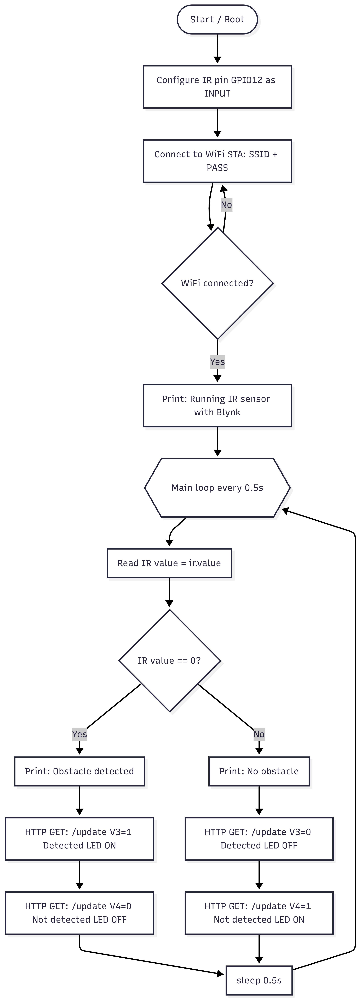
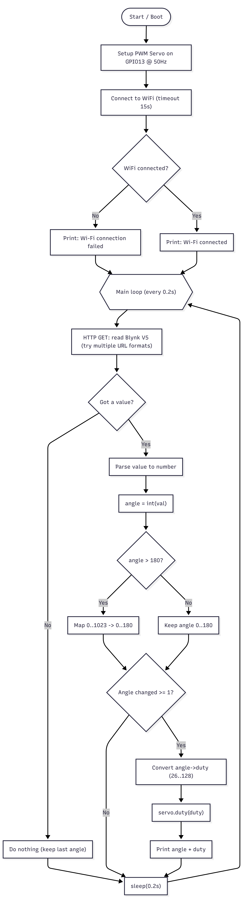
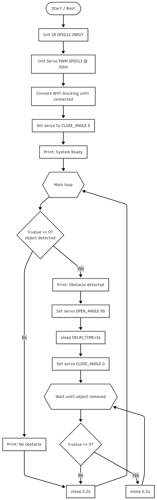
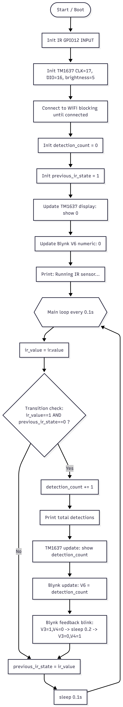
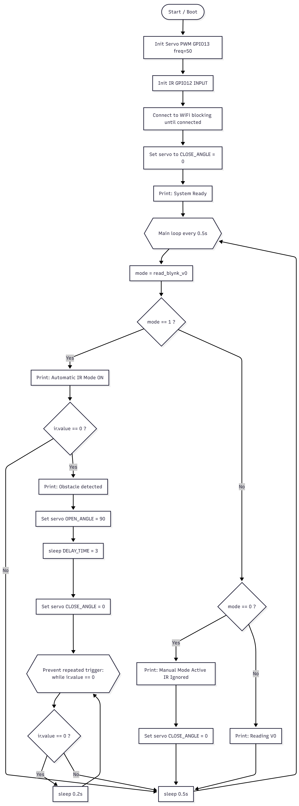

# Lab3: IoT Smart Gate Control With Blynk, IR Sensor, Servo Motor, and TM1637
## 1. Overview
This lab aims to design and implement an ESP32-based IoT system using Micropython and the Blynk platform. The system integrates an IR sensor for object detection, a servo motor for physical actuation, and a TM1637 7-segment display for real-time local feedback. 
## 2. Equipment
- ESP32 Dev Board
- 16x2 LCD Display
- 12C LCD Backpack (PCF8574)
- Jumper Wires
- USB cable for ESP32
## 3. Wiring Connection
  
  
#### IR Sensor → ESP32
| IR Sensor | ESP32 Pin |
|----------|-----------|
| VCC | VCC/5V |
| OUT | GPIO 12 (D12) |
| GND | GND |

#### Sevor Sensor → ESP32
| Servo Sensor | ESP32 Pin |
|----------|-----------|
| Yellow Wire | GPIO 13 (D13) |
| Red Wire | VCC/5V |
| Brown Wire | GND |

#### TM1637 → ESP32
| TM1637| ESP32 Pin |
|----------|-----------|
| GND | GND |
| VCC | VCC/5V |
| DIO | GPIO 16 (D16) |
| CLK | GPIO 17 (D17) |

## 4. System Description
An IR sensor is used to sense when an object approaches the system. Once detection occurs, the ESP32 interprets the signal and drives a servo motor to mimic the opening of a gate or barrier. Every time an object is detected, a counter increases, and the updated count is a shown a TM1637 display while also being transmitted to the Blynk application for remote tracking. 

## 5. Setup Instructions

### 1. Install Required Software

* Flash **MicroPython firmware** to the ESP32
* Install **Thonny IDE**
* Download required libraries:

  * `tm1637.py`
```python
from machine import Pin
from time import sleep_us

# TM1637 commands
CMD_DATA = 0x40      # auto increment
CMD_ADDR = 0xC0      # start address
CMD_CTRL = 0x80      # display control

# Digit to 7-segment mapping (0–9)
SEGMENTS = [
    0x3F,  # 0
    0x06,  # 1
    0x5B,  # 2
    0x4F,  # 3
    0x66,  # 4
    0x6D,  # 5
    0x7D,  # 6
    0x07,  # 7
    0x7F,  # 8
    0x6F   # 9
]

class TM1637:
    def __init__(self, clk_pin, dio_pin, brightness=7):
        self.clk = Pin(clk_pin, Pin.OUT, value=1)
        self.dio = Pin(dio_pin, Pin.OUT, value=1)
        self.brightness = brightness
        self._update_display()

    # ---------- Low-level protocol ----------
    def _start(self):
        self.dio.value(0)
        sleep_us(10)
        self.clk.value(0)

    def _stop(self):
        self.clk.value(1)
        sleep_us(10)
        self.dio.value(1)

    def _write_byte(self, data):
        for i in range(8):
            self.dio.value(data & 0x01)
            data >>= 1
            self.clk.value(1)
            sleep_us(10)
            self.clk.value(0)
        # ignore ACK
        self.clk.value(1)
        sleep_us(10)
        self.clk.value(0)

    # ---------- Display control ----------
    def _update_display(self):
        self._start()
        self._write_byte(CMD_CTRL | 0x08 | self.brightness)
        self._stop()

    def set_brightness(self, value):
        self.brightness = max(0, min(value, 7))
        self._update_display()

    # ---------- High-level function ----------
    def show_number(self, num):
        num = max(0, min(num, 9999))
        digits = [
            num // 1000 % 10,
            num // 100 % 10,
            num // 10 % 10,
            num % 10
        ]

        self._start()
        self._write_byte(CMD_DATA)
        self._stop()

        self._start()
        self._write_byte(CMD_ADDR)
        for d in digits:
            self._write_byte(SEGMENTS[d])
        self._stop()

        self._update_display()
    def show_digit(self, num):
        """
        Display number (0–9999) with NO leading zeros.
        Unused digits are blank.
        Examples:
          show_digit(4)    ->    '   4'
          show_digit(12)   ->    '  12'
          show_digit(123)  ->    ' 123'
          show_digit(1234) ->    '1234'
        """
        if not 0 <= num <= 9999:
            return

        s = str(num)                  # convert number to string
        data = [0x00, 0x00, 0x00, 0x00]  # blank display

        start = 4 - len(s)            # right alignment
        for i, ch in enumerate(s):
            data[start + i] = SEGMENTS[int(ch)]

        # send data to TM1637
        self._start()
        self._write_byte(CMD_DATA)
        self._stop()

        self._start()
        self._write_byte(CMD_ADDR)
        for seg in data:
            self._write_byte(seg)
        self._stop()

        self._update_display()

```

### 2. Hardware Setup

* Connect the IR sensor, servo motor, and TM1637 display to the ESP32 according to the wiring table provided in this document.
* Power the ESP32 using a USB cable.

### 3. Configure Blynk

1. Create a new project in **Blynk**
2. Select **ESP32** as the device and **WiFi** as connection type
3. Copy the **Auth Token**
4. Create the following widgets:

| Widget          | Virtual Pin | Function             |
| --------------- | ----------- | -------------------- |
| LED             | V3          | IR Detected          |
| LED             | V4          | IR Not Detected      |
| Slider (0–180)  | V5          | Manual Servo Control |
| Numeric Display | V6          | IR Detection Counter |
| Switch          | V0          | Manual Override Mode |

### 4. Upload Code

1. Connect ESP32 to computer
2. Open python file in Thonny
3. Edit WiFi and Blynk credentials:

```python
WIFI_SSID = "your_wifi_name"
WIFI_PASS = "your_wifi_password"
BLYNK_Token = "your_auth_token"
BLYNK_API   = "http://blynk.cloud/external/api"
```

4. Upload `tm1637.py` to ESP32
5. Restart the ESP32

## 5. Tasks and Checkpoints
### Task 1: IR Sensor Reading
- Read IR sensor digital output using ESP32
- Display IR status (Detected / Not Detected) on Blynk


- Flowchart



### Task 2: Servo Motor Control via Blynk
- Add a Blynk Slider widget to control servor position.
- Slider position from 0 to 180 degree and the servo is moving following the slider. <br>
- Video Evidence: https://youtu.be/4t-Uhp8_JVw?feature=shared
- Flowchart


### Task 3: Automatic IR- Servo Action
- When IR sensor detects an object, servo opens automatically.
- After a short delay, servo returns to closed position. <br>
- Video Evidence: https://youtu.be/sCNMGhiOjLc?feature=shared
- Flowchart


### Task 4: TM1637 Display Integration
- Count the number of IR detection events.
- Display the counter value on the TM1637 display.
- Send the same value to Blynk numeric display widget. <br>
- Video Evidence: https://youtu.be/w7w-R8_-Dso?feature=shared
- Flowchart


### Task 5: Manual Override Mode
- Add a Blynk switch to enable/disable automic IR mode.
- When manual mode is active, IR sensor is ignored. <br>
- Video Evidence: https://youtu.be/g4tDh4JYB_U?feature=shared
- Flowchart


